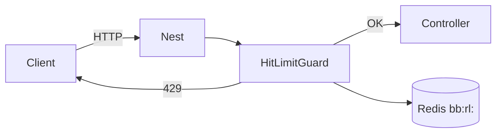

# Rate limiting Nest — `@joint-ops/hitlimit`

## Dépendance

| Paquet | Rôle |
|--------|------|
| **`@joint-ops/hitlimit`** | Limiteur HTTP pour l’API Nest (guard global + décorateur par route). |
| Store **mémoire** (défaut) ou **Redis** via `redisStore` du même paquet. |

Documentation officielle : [hitlimit.jointops.dev](https://hitlimit.jointops.dev/docs/adapters/nestjs).

### Pourquoi un fichier `hitlimit.ts` local ?

Le paquet est **ESM-only** ; les sous-chemins `@joint-ops/hitlimit/nest` cassent le `require()` de Nx/Webpack au runtime. Le serveur réexporte depuis les builds compilés du paquet :

- `server/src/core/rate-limit/hitlimit.ts` → `dist/nest.js`, `dist/stores/redis.js`
- Webpack du serveur **bundle** hitlimit (ne pas l’externaliser).

## Où c’est branché

| Fichier | Rôle |
|---------|------|
| `server/src/core/app.module.ts` | `HitLimitModule.registerAsync` + `APP_GUARD` → `HitLimitGuard` (global). |
| `server/src/core/rate-limit/hitlimit.factory.ts` | Plafond par défaut, clé IP, skip, store Redis. |
| `server/src/core/rate-limit/rate-limit.limits.ts` | Limites **par route** (`routeHitLimits`). |
| `server/src/main.ts` | `RATE_LIMIT_TRUST_PROXY=1` → `app.set('trust proxy', 1)` pour `req.ip` derrière nginx. |

## Règles de limitation

### Clé de comptage

- **Par IP client** : `req.ip` (ou adresse socket si absent).
- Derrière un reverse proxy : activer **`RATE_LIMIT_TRUST_PROXY=1`** pour que Express utilise `X-Forwarded-For`.

### Plafond global (toutes les routes API)

Sauf exceptions ci-dessous, chaque IP a un budget **fixe** :

| Variable | Défaut | Effet |
|----------|--------|--------|
| `RATE_LIMIT_DEFAULT` | `100` | Nombre max de requêtes |
| `RATE_LIMIT_WINDOW` | `1m` | Fenêtre (ex. `1m`, `15m`, `1h`) |

Réponse en cas de dépassement : **HTTP 429** + en-têtes rate limit (`Retry-After`, etc.).

### Routes exclues du plafond global

Le guard **ne compte pas** :

- `*/ping`
- tout chemin contenant `/docs`

### Limites renforcées (`@HitLimit`)

Certaines routes ont un plafond **plus strict** que le global (défini dans `rate-limit.limits.ts`, appliqué via `@HitLimit(...)` sur le contrôleur) :

| Politique | Route Nest | Limite | Fenêtre | Variables `.env` |
|-----------|------------|--------|---------|------------------|
| **login** | `POST /api/auth/login` | 5 | 15m | `RATE_LIMIT_LOGIN`, `RATE_LIMIT_LOGIN_WINDOW` |
| **refresh** | `POST /api/auth/refresh` | 30 | 15m | (fixe dans le code) |
| **passwordResetRequest** | `POST /api/auth/password-reset/request` | 3 | 1h | (fixe) |
| **passwordResetConfirm** | `POST /api/auth/password-reset/confirm` | 10 | 15m | (fixe) |
| **profileVerifyPassword** | `POST /api/users/me/profile/verify-password` | 10 | 15m | (fixe) |
| **accountVerifyPassword** | `POST /api/users/me/account/verify-password` | 5 | 15m | (fixe) |

Contrôleurs concernés :

- `server/src/auth/controllers/passport-jwt-auth.controller.ts`
- `server/src/auth/controllers/password-reset.controller.ts`
- `server/src/users/controllers/users.controller.ts`

### Store Redis (multi-instance / prod)

| Variable | Effet |
|----------|--------|
| `REDIS_URL` | Si défini → compteurs Redis (ex. `redis://127.0.0.1:6379`). |
| `RATE_LIMIT_STORE=memory` | Force le store **mémoire** (une seule instance Nest). |
| `RATE_LIMIT_STORE=redis` | Force Redis même sans `REDIS_URL` (construit l’URL depuis `REDIS_HOST` / `REDIS_PORT`). |
| `RATE_LIMIT_REDIS_PREFIX` | Préfixe des clés (défaut `bb:rl:`). |

Sans Redis : compteurs **en mémoire du process** — insuffisant si plusieurs replicas PM2/Docker.

## Configuration — `server/.env`

Bloc en fin de `server/.env.example` :

```env
RATE_LIMIT_DEFAULT=100
RATE_LIMIT_WINDOW=1m
RATE_LIMIT_LOGIN=5
RATE_LIMIT_LOGIN_WINDOW=15m
REDIS_URL=redis://127.0.0.1:6379
# RATE_LIMIT_TRUST_PROXY=1
```

## Ce que hitlimit ne couvre pas

- **Next.js BFF** (`/api/*` sur le port 3001) : voir [`use.upstash.md`](./use.upstash.md).
- **Login navigateur direct** : le client appelle souvent **Nest en direct** (`NEXT_PUBLIC_AUTH_API`) pour `POST /auth/login` — la limite **login** hitlimit s’applique bien **sur Nest**, pas sur le BFF.
- Trafic **BFF → Nest** : l’IP vue par Nest peut être celle du serveur Next si le proxy ne transmet pas correctement `X-Forwarded-For` — d’où l’intérêt d’un second filet sur le BFF.

## Schéma (couche API)


