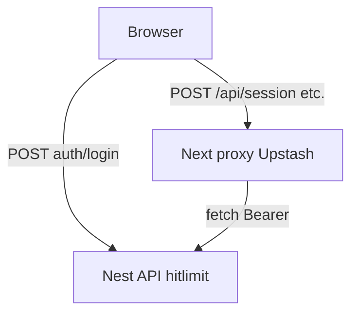

# Rate limiting BFF Next — `@upstash/ratelimit`

## Dépendances

| Paquet | Rôle |
|--------|------|
| **`@upstash/ratelimit`** | Algorithmes de limitation (ici **sliding window**). |
| **`@upstash/redis`** | Client Redis **HTTP/REST** (compatible Edge / proxy Next). |

Installés dans **`bugbountyapp/client/package.json`**.

Documentation : [Upstash Ratelimit TS](https://upstash.com/docs/redis/sdks/ratelimit-ts/overview).

### Différence avec Redis Nest / hitlimit

| | Nest (`hitlimit`) | BFF Next (`@upstash/ratelimit`) |
|--|-------------------|--------------------------------|
| Connexion | `redis://` (TCP, ioredis) | **REST** : `UPSTASH_REDIS_REST_URL` + `UPSTASH_REDIS_REST_TOKEN` |
| Préfixe clés | `bb:rl:` | `bb:bff:{policy}` |
| Emplacement | Guard Nest global | **`client/proxy.ts`** (Next 16) |

Le `REDIS_URL` du **`server/.env`** ne suffit **pas** pour le BFF : il faut une base Upstash (Console) ou un **proxy REST** vers Redis local (voir doc Upstash *developing locally*).

## Où c’est branché

| Fichier | Rôle |
|---------|------|
| `client/lib/server/bff-rate-limit.ts` | Politiques, limiters Upstash, IP, en-têtes. |
| `client/proxy.ts` | Pour `/api/*` : vérifie la limite **avant** le proxy i18n ; sinon i18n seul. |

Next.js 16 renomme `middleware.ts` en **`proxy.ts`** — on ne peut pas avoir les deux ; le rate limit est **fusionné** dans le proxy existant (`next-i18next`).

Matcher proxy : `/api/:path*` + routes pages (i18n).

## Activation

Limitation **désactivée** automatiquement si `NODE_ENV` vaut `development` ou `test` (voir `client/lib/server/is-rate-limit-enabled.ts`).

En **production**, limitation active seulement si Upstash est configuré :

```env
UPSTASH_REDIS_REST_URL=https://….upstash.io
UPSTASH_REDIS_REST_TOKEN=…
```

Sinon : requêtes **autorisées** (pas de 429), avec un **warning** une fois en production.

| Variable | Effet |
|----------|--------|
| `BFF_RATE_LIMIT_FORCE=1` | Force la limitation en local (dev), si Upstash est configuré. |
| `BFF_RATE_LIMIT_DISABLED=1` | Désactive explicitement (même en production). |
| `BFF_RATE_LIMIT_TRUST_PROXY=1` | IP depuis `X-Forwarded-For` / `X-Real-IP` (nginx, VPS). |

## Règles de limitation

### Clé de comptage

- Identifiant : **`{ip}:{policy}`** (une fenêtre par politique, pas un seul bucket global pour tout `/api`).
- IP : voir `clientIp()` dans `bff-rate-limit.ts` (proxy ou `127.0.0.1` en local sans `TRUST_PROXY`).

### Politiques

| Politique | Route BFF | Limite (défaut) | Fenêtre | Variables `.env` |
|-----------|-----------|-----------------|---------|------------------|
| **default** | Tout `/api/*` non listé ci-dessous | 100 | 1m | `BFF_RATE_LIMIT_DEFAULT`, `BFF_RATE_LIMIT_WINDOW` |
| **session-establish** | `POST /api/session` | 30 | 15m | `BFF_RATE_LIMIT_SESSION`, `BFF_RATE_LIMIT_SESSION_WINDOW` |
| **profile-verify-password** | `POST /api/account/profile/verify-password` | 10 | 15m | `BFF_RATE_LIMIT_PROFILE_VERIFY`, `BFF_RATE_LIMIT_PROFILE_VERIFY_WINDOW` |
| **account-verify-password** | `POST /api/account/verify-password` | 5 | 15m | `BFF_RATE_LIMIT_ACCOUNT_VERIFY`, `BFF_RATE_LIMIT_ACCOUNT_VERIFY_WINDOW` |
| **register-user** | `POST /api/account/register-user` | 5 | 15m | `BFF_RATE_LIMIT_REGISTER`, `BFF_RATE_LIMIT_REGISTER_WINDOW` |

Les step-up **profile** / **account** sont alignés sur les mêmes chiffres que Nest `routeHitLimits` dans `server/src/core/rate-limit/rate-limit.limits.ts`.

### Réponse 429

Corps JSON :

```json
{ "error": "Too many requests" }
```

En-têtes (si limite active) : `X-RateLimit-Limit`, `X-RateLimit-Remaining`, `X-RateLimit-Policy`, `X-RateLimit-Reset`, `Retry-After` si bloqué.

## Configuration — `client/.env`

Bloc dans `client/.env.example` (à copier vers `.env.local` / env de build prod).

## Défense en profondeur (avec Nest)



| Trafic | Limité par |
|--------|------------|
| Login / refresh **direct Nest** | **hitlimit** (`use.hitlimiter.md`) |
| Cookie session, compte, report-draft via BFF | **Upstash** sur Next **puis** hitlimit global sur Nest au proxy |
| Abus volumétrique sur Next seul | Surtout **Upstash** (Nest ne voit pas le trafic tant que le BFF n’a pas relayé) |

Recommandation prod :

1. `UPSTASH_*` + `BFF_RATE_LIMIT_TRUST_PROXY=1` sur le front.
2. `REDIS_URL` + `RATE_LIMIT_TRUST_PROXY=1` sur l’API.
3. Optionnel : rate limit nginx devant les deux origines.

## Mise en service (rappel)

1. Créer une base sur [console.upstash.com](https://console.upstash.com/).
2. Coller REST URL + token dans l’environnement du **client** Next.
3. `pnpm build` dans `client/` puis redémarrer le process front (les vars `UPSTASH_*` doivent être présentes au **build** si utilisées côté edge/proxy selon hébergement).

Voir aussi : [`use.hitlimiter.md`](./use.hitlimiter.md).
